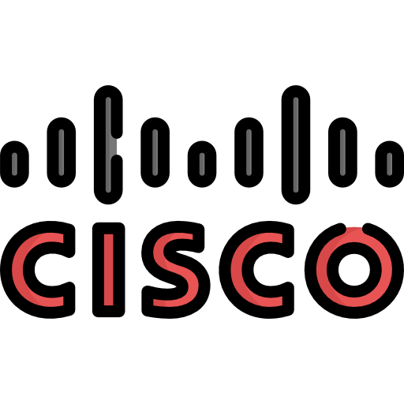
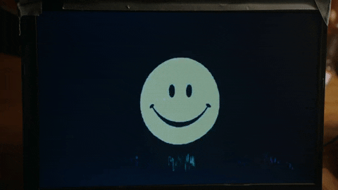

#  Thomas

## Étudiant en M1 STRI

<h3>⚡️ <u>A Few Quick Facts</u></h3>
<ul>
<li>👨‍💻 Most of my projects are available on <a href="https://github.com/Tiimoon">Github</a>.</li>
<li>📝 Dont forget to watch my websites !</li>
</ul>

| Websites Name | Website URL |
| -------------- | :--------- |
| PortFolio | thomas.ribaut.eu |

 
 

## **Mes Compétances** 

Création intégrale de réseau, conf routeur, switch, création de réseau logique.

Configuration de serveur "Linux" et "Windows"
 
 
 
 

 
 
 
 

Apprenti dans le domaine de la cyber sécurité réseau.
